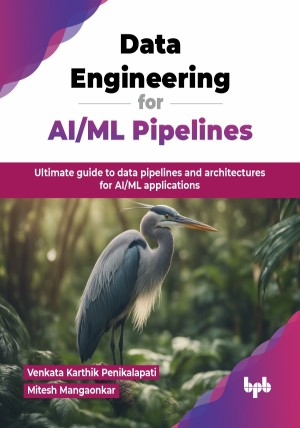

# Data Engineering for AI/ML Pipelines

Ultimate guide to data pipelines and architectures for AI/ML applications.

This is the repository for [Data Engineering for AI/ML Pipelines
](https://bpbonline.com/products/data-engineering-for-ai-ml-pipelines?variant=44178762629320),published by BPB Publications.

## About the Book
Data engineering is the art of building and managing data pipelines that enable efficient data flow for AI/ML projects. This book serves as a comprehensive guide to data engineering for AI/ML systems, equipping you with the knowledge and skills to create robust and scalable data infrastructure.

This book covers everything from foundational concepts to advanced techniques. It begins by introducing the role of data engineering in AI/ML, followed by exploring the lifecycle of data, from data generation and collection to storage and management. Readers will learn how to design robust data pipelines, transform data, and deploy AI/ML models effectively for real-world applications. The book also explains security, privacy, and compliance, ensuring responsible data management. Finally, it explores future trends, including automation, real-time data processing, and advanced architectures, providing a forward-looking perspective on the evolution of data engineering.

By the end of this book, you will have a deep understanding of the principles and practices of data engineering for AI/ML. You will be able to design and implement efficient data pipelines, select appropriate technologies, ensure data quality and security, and leverage data for building successful AI/ML models.

## What You Will Learn
• Architect scalable data solutions for AI/ML-driven applications.

• Design and implement efficient data pipelines for machine learning.

• Ensure data security and privacy in AI/ML systems.

• Leverage emerging technologies in data engineering for AI/ML.

• Optimize data transformation processes for enhanced model performance. 
